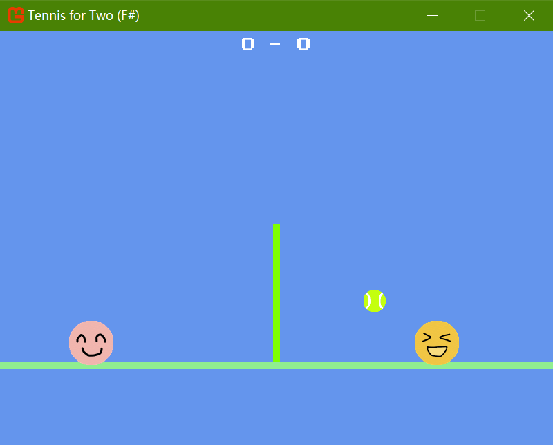

# Tennis for Two (MonoGame, F#)



## Description

_Tennis for Two_ was the historic 1958 video game developed by William Higinbotham, widely considered one of the first video games ever created. This implementation is a dedicated recreation of the classic game, using MonoGame and F# to bring it to modern platforms.

While F# isn't commonly used with MonoGame, this project serves as a great example of how to use F# with MonoGame to create a simple yet engaging game.

Features include:
- Parabolic ball motion with realistic physics
- Two-player gameplay with net collision detection
- Multiple game states (Title, Playing, Paused)
- Score tracking and display
- Hand-drawn graphics from emojis

## Important Note
The game's font file, `mario-tennis-gbc.ttf`, is located in the "Content" folder, but it may not always be recognized by the MonoGame Content Builder when running the project. *__Manual installation of the font on your system is strongly recommended for reliable loading.__*

## Installation
1. Install [.NET SDK 8.0+](https://dotnet.microsoft.com/en-us/download/dotnet/8.0) if you haven't already.
2. Clone this repository and navigate to the project directory:
   ```bash
   git clone https://github.com/yourusername/TennisForTwo.FSharp.git
   cd TennisForTwo.FSharp
   ```
3. Install the font file `mario-tennis-gbc.ttf` (from the "Content" folder) on your system.
4. Restore dependencies, then build and run the project:
   ```bash
   dotnet restore
   dotnet run
   ```

## Controls

- Player 1 (Left) moves orthogonally using W,A,S,D keys.
- Player 2 (Right) moves orthogonally using the arrow keys.
- **Space**: Start game from title screen
- **P**: Pause/resume game during gameplay
- **R**: Restart game from pause state
- **Escape**: Exit the game

## License
This project is licensed under the MIT License. See the [LICENSE](LICENSE) file for details.